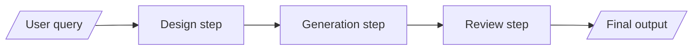

# Intro to chains

## Idea

Sometimes, prompt engineering on a single LLM call can only take us so far. The goal of this stage is to introduce the concepts of chains. This can be a useful resource for those tasks where a sequential flow can be more effective compared to a single call to the LLM. This is comparable to what we as humans do for many activities, not only as a way to distribute labor, but because it makes some problems easier to approach for us (e.g., writing a book, where we first outline the chapters and then write them one by one).

In this case, we will demonstrate how to improve the generator by breaking the previous prompt into the following steps:

- A design step, where we ask the LLM to come up with a preliminary description of what should be generated based on the user's query.
- A generation step, where we ask the LLM to generate the final output based on the design.
- A reviews step, where we make sure that the output is executed correctly and we fix potential errors.

### Target flow 

