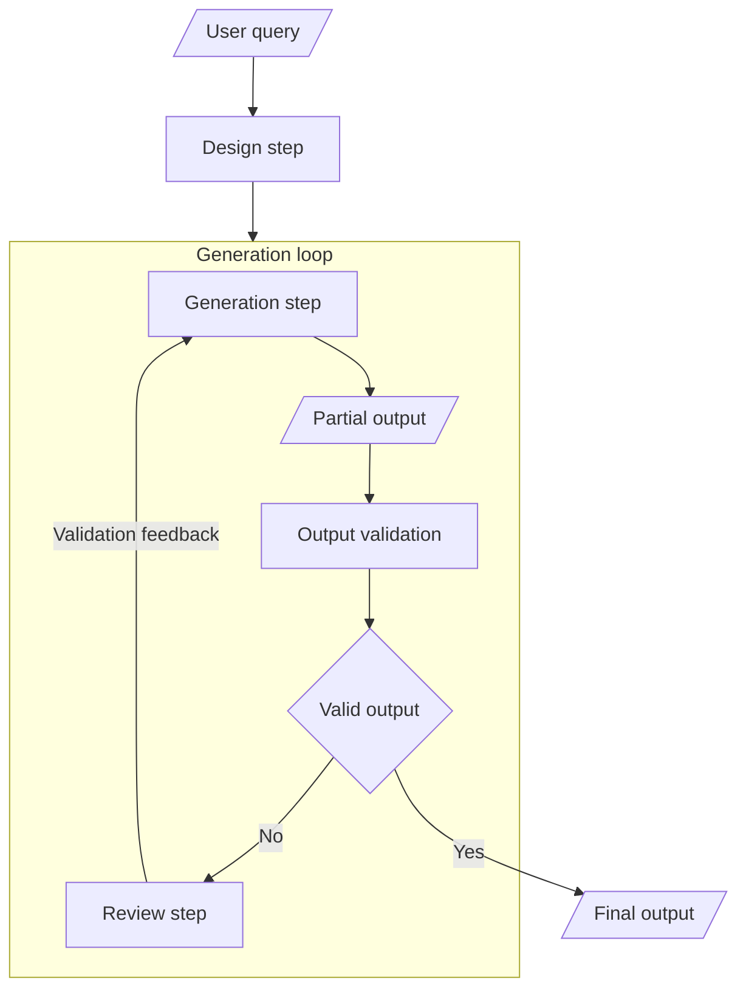

# Closing the loop

## Idea

Sequential linear flows can already improve the situation by splitting a big task into smaller tasks to make it easier for the LLM to focus. However, there is still no guarantee that the LLM will return a valid answer. The only way to ensure that the answer that we are getting is valid is to check it. This is where the idea of closing the loop comes in.

Depending on the problem at hand, we will have different options to check the answer. A common approach that will work for most problems is to use a separate call to an LLM to check the output that we are getting, which is usually referred to as "LLM-as-a-judge". The biggest advantage of this approach is that it can cover a very wide range of problems. However, this flexibility comes at a cost: we are still using an LLM, hence there is also uncertainty about the checking process.

In our particular case, we have some other options to check the output. Since SVG is defined as code that follows a specific standard, we can use a validation tool, the same way we would use tools like linters or formatters for other programming languages. This way, we should remove the uncertainty of part of the review process, i.e. the validation of the SVG code.

### Target flow

### Output validation

For the output validation we are going to use [`svglint`](https://github.com/simple-icons/svglint), which is an NPM package that can be used to validate SVG files. It is a linter for SVG files that checks for common issues and best practices.
